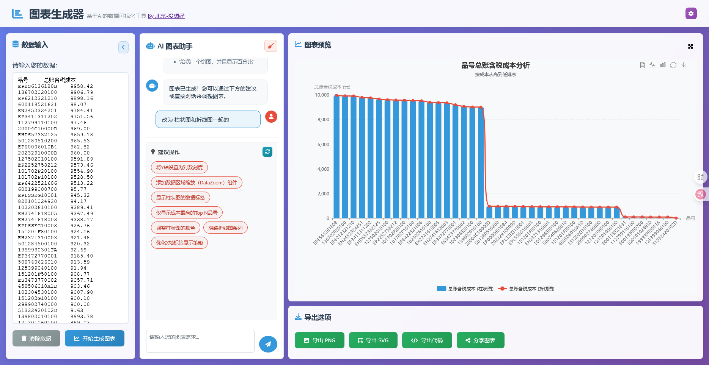
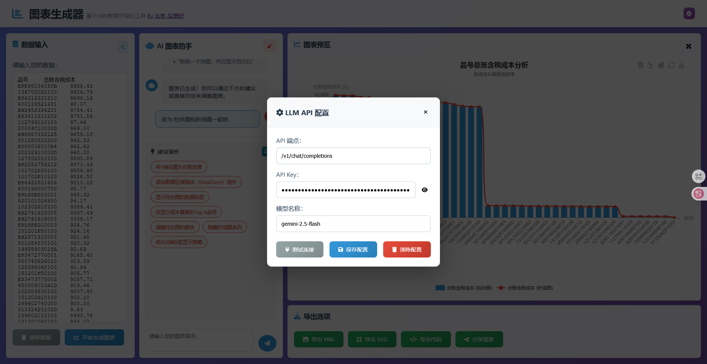

# 智能图表生成器 (AI Chart Generator)

> 🎯 **让数据可视化变得简单而智能** - 通过AI驱动的智能分析，一键生成专业级数据可视化图表



#阿里云ESA Pages #阿里云云工开物

本项目是阿里云 ESA (Edge Security Acceleration) 边缘计算创新大赛的创意参赛作品。借助 阿里云 ESA强大的边缘计算能力，我们将这个富交互的静态网站分发到全球节点，确保用户在世界任何角落都能体验到闪电般的加载速度。


## 项目亮点

### 创意卓越
- **AI驱动的智能分析**：利用先进的大语言模型（LLM）自动分析数据并推荐最适合的图表类型
- **自然语言交互**：通过对话式界面，用户可以直接用自然语言描述需求来调整图表
- **智能配置生成**：AI自动为图表生成最佳的视觉配置，无需手动调整参数

### 应用价值
- **零门槛使用**：无需编程经验或图表专业知识，任何人都能轻松生成专业图表
- **多格式数据支持**：支持CSV、JSON、TSV等多种数据格式，适应各种数据来源
- **快速原型制作**：几秒钟内即可从原始数据生成精美的可视化图表
- **跨平台部署**：纯前端应用，可在任何现代浏览器中运行

### 技术探索
- **前沿AI集成**：将大语言模型与数据可视化无缝结合
- **动态表单生成**：根据数据特征动态生成相应的配置选项
- **SVG渲染支持**：支持高保真SVG图表导出，满足专业印刷需求

## 功能特性

### 1. 数据输入与管理
- **多格式数据输入**：支持CSV、JSON、TSV等常见数据格式
- **智能数据解析**：自动识别数据结构、列名和数据类型
- **数据预处理提示**：提供格式示例和输入指导

### 2. 大模型（LLM）API配置
- **API密钥管理**：安全存储和管理大模型API密钥
- **连接测试功能**：一键测试API连接有效性
- **多模型支持**：支持OpenAI GPT、Claude等主流大模型

### 3. AI智能分析 - 图表类型推荐
- **数据特征分析**：自动分析数据的结构、类型和分布
- **智能图表推荐**：根据数据特征推荐最适合的图表类型
- **推荐理由说明**：提供推荐依据和图表适用场景

### 4. AI智能分析 - 图表配置生成
- **动态配置表单**：根据图表类型生成相应的配置选项
- **智能参数建议**：为每个配置项提供合理的默认值
- **实时配置验证**：即时验证用户输入的配置参数

### 5. 图表生成与预览
- **实时预览**：配置调整时图表实时更新
- **交互式图表**：支持缩放、平移、悬停提示等交互功能
- **多种图表类型**：支持柱状图、折线图、饼图、散点图、雷达图等多种图表

### 6. 图表导出功能
- **PNG导出**：导出高分辨率PNG格式图片
- **SVG导出**：导出矢量SVG格式图片，支持无限缩放
- **ECharts代码导出**：导出完整的ECharts配置代码
- **分享链接生成**：生成图表分享链接，方便协作

### 7. 高级功能
- **图表最大化**：支持图表全屏显示和自定义分辨率
- **对话式调整**：通过自然语言与AI助手交互调整图表
- **建议操作**：提供智能操作建议，快速优化图表
- **历史记录**：保存对话历史和图表配置

## 快速开始

### 环境要求
- **操作系统**：Windows 7+, macOS 10.12+, Linux发行版
- **浏览器**：Chrome 90+, Firefox 88+, Safari 14+, Edge 90+
- **网络**：稳定的互联网连接（用于调用AI API）
- **API密钥**：OpenAI或其他支持的大模型API密钥

### 安装步骤
1. **克隆项目**
   ```bash
   git clone <repository-url>
   cd tushuo
   ```

2. **或者直接下载**
   - 从GitHub下载项目ZIP文件
   - 解压到本地目录

### 启动应用
1. **本地启动**
   - 直接双击 `index.html` 文件在浏览器中打开
   - 或使用本地服务器：
     ```bash
     # 使用Python启动
     python -m http.server 8000
     # 或使用Node.js
     npx serve .
     ```

2. **访问应用**
   - 浏览器会自动打开应用界面
   - 首次使用需要配置API密钥

### 初次使用指南
1. **配置API**
   - 点击右上角齿轮图标打开配置界面
   - 输入API端点、密钥和模型名称
   - 点击"测试连接"验证配置
   - 点击"保存配置"保存设置

2. **输入数据**
   - 在左侧数据输入区域粘贴或输入数据
   - 支持CSV、JSON等多种格式

3. **生成图表**
   - 点击"开始生成图表"按钮
   - 等待AI分析并生成推荐图表
   - 在右侧查看生成的图表

## 代码解读规则

### 项目结构
```
tushuo/
├── css/                 # 样式文件
│   ├── components.css   # 组件样式
│   └── styles.css       # 主样式
├── js/                  # JavaScript源码
│   ├── apiClient.js     # AI API客户端
│   ├── app.js           # 主应用逻辑
│   ├── chartGenerator.js # 图表生成器
│   ├── dataProcessor.js # 数据处理器
│   ├── formBuilder.js   # 表单生成器
│   └── utils.js         # 工具函数
├── images/              # 图片资源
├── examples/            # 示例数据
├── index.html          # 主页面
├── share.html          # 分享页面
├── test-*.html         # 测试页面
└── README.md           # 项目说明
```

### 核心文件功能
- **app.js**：主应用程序类，负责协调各模块和处理用户交互
- **apiClient.js**：AI API客户端，处理与大语言模型的通信
- **chartGenerator.js**：图表生成器，使用ECharts渲染图表
- **dataProcessor.js**：数据处理器，解析和处理输入数据
- **formBuilder.js**：动态表单生成器，根据AI返回生成配置表单
- **utils.js**：通用工具函数库

### 核心实现逻辑
1. **数据流向**：数据输入 → AI分析 → 图表配置生成 → 图表渲染
2. **AI交互**：用户输入 → API调用 → LLM处理 → 结果解析
3. **图表渲染**：配置对象 → ECharts API → SVG/PNG输出
4. **状态管理**：通过应用实例管理图表状态和用户配置

### 关键类和方法
- **ChartGeneratorApp**：主应用类，处理UI交互
- **ApiClient**：API客户端类，处理AI通信
- **ChartGenerator**：图表生成类，处理ECharts渲染
- **Utils**：工具函数集合

## 技术栈

### 前端技术
- **HTML5**：页面结构和语义化标记
- **CSS3**：样式设计和响应式布局
- **JavaScript (ES6+)**：应用逻辑和交互功能
- **ECharts 5.4.3**：强大的数据可视化图表库
- **Font Awesome**：图标字体库
- **Pako**：数据压缩库，用于分享功能

### AI集成技术
- **RESTful API**：与大语言模型通信
- **Fetch API**：异步HTTP请求处理
- **JSON Schema**：数据格式验证
- **Prompts Engineering**：AI提示工程

### 开发工具
- **浏览器本地存储**：配置和数据持久化
- **XMLHttpRequest**：数据传输
- **Canvas API**：PNG图像处理
- **SVG**：矢量图形渲染

### 依赖库版本
- ECharts: 5.4.3
- Pako: 2.1.0
- Font Awesome: 6.4.0

## 项目特点

### 架构特色
- **模块化设计**：各功能模块职责分离，便于维护和扩展
- **插件化架构**：易于集成新的AI模型和图表类型
- **响应式设计**：适配桌面和移动设备
- **渐进式增强**：基础功能在所有浏览器中可用

### 设计模式
- **MVC模式**：清晰的模型-视图-控制器分离
- **观察者模式**：UI状态变化的响应机制
- **工厂模式**：图表类型的动态创建
- **单例模式**：全局状态管理

### 性能优化
- **懒加载**：按需加载图表资源
- **缓存机制**：API响应和用户配置缓存
- **防抖节流**：优化频繁操作的性能
- **内存管理**：及时释放图表实例和事件监听器

### 用户体验
- **直观界面**：简洁清晰的三栏布局
- **实时反馈**：操作响应和加载状态提示
- **智能提示**：上下文相关的操作建议
- **无障碍设计**：支持键盘导航和屏幕阅读器

### 安全特性
- **客户端处理**：数据处理完全在浏览器中完成
- **API密钥保护**：敏感信息本地加密存储
- **输入验证**：防止恶意数据注入
- **CORS安全**：遵循浏览器安全策略

---

## 声明

“本项目由阿里云ESA提供加速、计算和保护”


